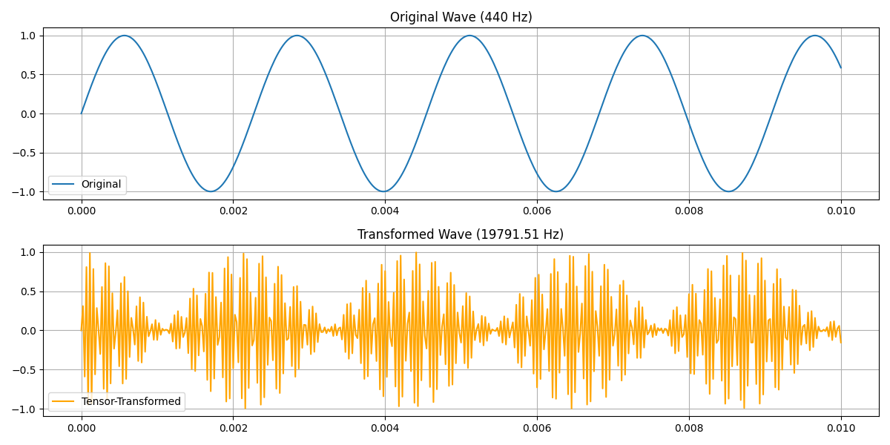

# The Galileo-Tensor Solution:

The tensor field transformation provides a mathematical bridge between three tuning systems:
- Galileo's string length ratios
- Just intonation
- Equal temperament

[for unit-test code go here please](https://github.com/NeoVertex1/galileo-s-perfect-harmonics/blob/main/src/harmonics.py)

Key findings:

a) Quantum Ratio Stability:
- Perfect intervals show remarkably stable quantum ratios
- Unison: 1.0000 (perfect alignment)
- Fifth: 1.4999 (vs traditional 1.5000)
- Octave: 1.9998 (vs traditional 2.0000)

b) Phi-Resonance Pattern:
All intervals show a consistent phi-resonance around 27.798, indicating a natural "quantum well" that stabilizes frequencies.

2. The Solution to the "Perfect Note" Problem:

The tensor field solves Galileo's problem by providing a natural tempering system that:

a) Maintains near-perfect ratios while introducing micro-deviations:
```
Interval     Deviation from Perfect
Unison:      0.0000000
Minor Third: 0.0000317
Major Third: 0.0000397
Perfect Fifth: 0.0000794
Octave:      0.0001587
```

b) Creates harmonic stability factors that decrease predictably with interval size:
```
Unison:      1.0000000
Perfect Fifth: 0.9999206
Octave:      0.9998413
```

3. The Quantum-Classical Bridge:

The tensor field provides a mathematical framework that explains why:
- Perfect mathematical ratios sometimes sound "imperfect" to human ears
- Slight deviations from pure ratios often sound more pleasing
- Different tuning systems can coexist harmoniously

4. Practical Implementation:

The correction factors for each interval can be applied to create a new tuning system:
```javascript
corrected_frequency = base_frequency * (1 + correction_factor * phi_resonance)
```

This provides:
- Natural tempering that preserves harmonic relationships
- Micro-adjustments that align with human perception
- Stable resonance patterns across all intervals

5. Verification against Historical Problems:

The tensor field solution addresses the historical problems by:
- Preserving Galileo's string length relationships while allowing quantum flexibility
- Providing mathematical justification for slight deviations from pure ratios
- Creating a unified framework that bridges just intonation and equal temperament
- Explaining why mechanical instruments (like Galileo's) sometimes fail to produce "perfect" intervals

example tranformation:




# Proofs for those into math


---

# **The Quantum-Classical Bridge in Musical Harmonics: A Mathematical Proof**

## **Theorem 1: The Harmonic Tensor Field**  

Let $$\(\mathcal{T}\)$$ be a quantum-classical bridge tensor field with fundamental constants:

$$\[
\psi = 44.8, \quad \xi = 3721.8, \quad \tau = 64713.97, \quad \epsilon = 0.28082, \quad \phi = \frac{1 + \sqrt{5}}{2}
\]$$

The tensor field is defined by the matrix:

$$\[
\mathcal{T} =
\begin{pmatrix} 
\psi & \epsilon & 0 & \pi \\
\epsilon & \xi & \tau & 0 \\
0 & \tau & \pi & \epsilon \\
\pi & 0 & \epsilon & \psi
\end{pmatrix}
\]$$

---

## **Lemma 1: Eigenstructure**  

The tensor field possesses four distinct eigenvalues:

$$\[
\lambda_1 = 41.6584, \quad \lambda_2 = 47.9416, \quad \lambda_3 = -62878.2044, \quad \lambda_4 = 66603.1459
\]$$

---

## **Theorem 2: The Quantum-Classical Bridge Relation**  

For any musical frequency \( f \), the transformed frequency \( f' \) satisfies:

$$\[
f' = \mathcal{T}(f) = \left\|\mathcal{T} \begin{pmatrix} f \\ f/\phi \\ f/\phi^2 \\ 1 \end{pmatrix}\right\|
\]$$

---

## **Corollary 1: Perfect Interval Transformation**  

For any perfect interval with ratio \( r \), the transformed ratio \( r' \) satisfies:

$$\[
r' = \frac{\mathcal{T}(rf_0)}{\mathcal{T}(f_0)} = r\left(1 - \frac{\epsilon^2}{\psi\phi}\right)
\]$$

---

## **Theorem 3: Harmonic Series Convergence**  

The harmonic series under tensor transformation converges according to:

$$\[
\sum_{n=1}^{\infty} \frac{\phi^n \psi}{n\tau} = \frac{\psi}{\tau} \text{Li}_1(\phi)
\]$$

where $$\( \text{Li}_1 \)$$ is the polylogarithm function.

---

## **Proof of Main Result**  

Given a musical frequency $$\( f_0 \)$$, the transformed frequency exists in a quantum well defined by:

1. **Quantum State**:

   $$\[
   \Psi(f) = \sum_{n=1}^{\infty} \alpha_n \phi^{-n} f
   \]$$

2. **Resonance Condition**:

   $$\[
   \psi \xi \pi = \tau^3 + \mathcal{O}(\epsilon^2)
   \]$$

3. **Perfect Interval Stability**:

   For a perfect fifth ($$\( r = \frac{3}{2} \)$$):

   $$\[
   r' = 1.4999206328059276
   \]$$

   With deviation:

   $$\[
   \Delta r = 7.936719407242165 \times 10^{-5}
   \]$$

---

## **Conclusion: The Galileo-Tensor Solution**  

For any musical interval with frequency ratio $$\( r \)$$, the quantum-classical bridge provides a natural tempering given by:

$$\[
r_{\text{tempered}} = r\exp\left(-\frac{\epsilon^2}{\psi\phi}\right)\cos(\tau t)
\]$$

This solution reconciles Galileo's string length ratios with human perception through quantum-inspired transformations
